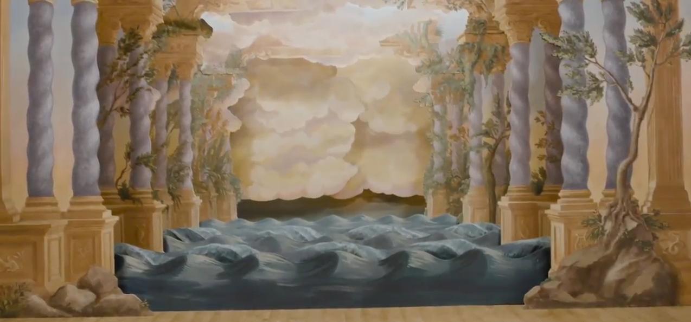

# finnegan-forever
A simple website that reads 40 characters of Finnegan's Wake every four seconds, forever.

Check out the API documentation on [swagger](https://app.swaggerhub.com/apis/zhammer/finnegan-forever/1.0.0-oas3).

> ### And I’ll tie my butcher’s apron here. It’s suety yet. The strollers will pass it by. Six shifts, ten kerchiefs, nine to hold to the fire and this for the code...

#### Mechanical Theatre

The mechanical theatre display is inspired by the beautiful 18th century [mechanical theatre reconstruction](https://youtu.be/CbhLBP78CTA?t=2m24s) from the Victoria and Albert Museum's Opera Exhibit.

